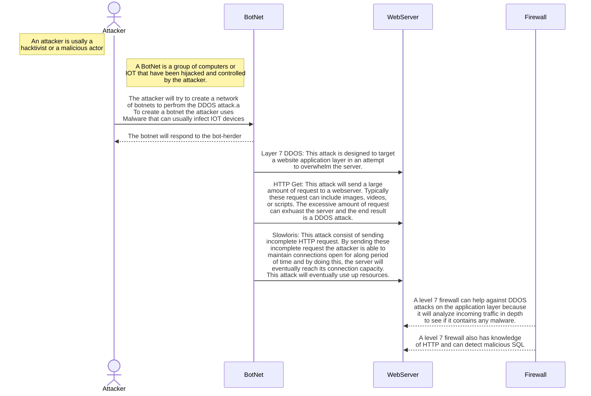

In the diagram above I have explained how a DDOS attacks works and the type of DDOS attack. According to the diagram it is a level 7 attack because it has "WebServer".
A level 7 DDOS attack on the webser are very common attacks. The attack usually starts by a hacktivist or an actor that must first create a BotNet, which will eventually flood a server
with multiple requests. To create a botnet the attacker will first try to infect multiple computers usually through malware such as a trojan. The goal of this attack is to infect as many
machines as possible. Once these machines are infected they will follow the command of the attacker who at this point is called a bot-herder. After the successful attacks on the IOT the
bot-herder will start the exploits. These bot-nets will attack the layer 7 because the layer seven is the application layer. One specific attack the bot-net uses is a HTTP GET, this will
send large amount of request to a server and usually it will request videos, images, or scripts. These request will cause the serves to become overwhelm and result in a DDOS attack.
Another attack is the slowrolis attack, this attack will send incomplete HTTP request and by doing this the connections maintain open for a long period of time and cause the server to 
to use up resources and exhaust the servers. This attack is very successful because of how slow the attack is and can maintain undetected.
