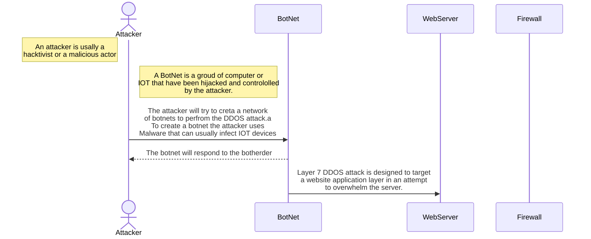

```mermaid
sequenceDiagram
actor Attacker
Note left of Attacker: An attacker is usally a<br/>hacktivist or a malicious actor
Note left of BotNet: A BotNet is a groud of computer or <br/>IOT that have been hijacked and contrololled<br/> by the attacker.
Attacker->>BotNet: The attacker will try to creta a network  <br/>of botnets to perfrom the DDOS attack.a<br/>To create a botnet the attacker uses <br/>  Malware that can usually infect IOT devices
BotNet-->>Attacker: The botnet will respond to the botherder
BotNet->>WebServer: Layer 7 DDOS attack is designed to target<br/>a website application layer in an attempt<br/>to overwhelm the server.
participant BotNet
participant WebServer
participant Firewall
```
